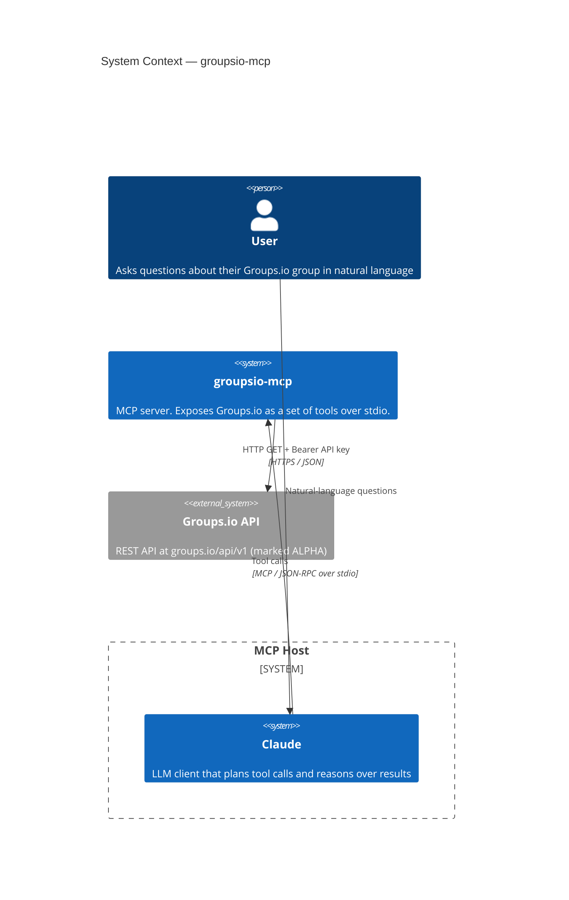
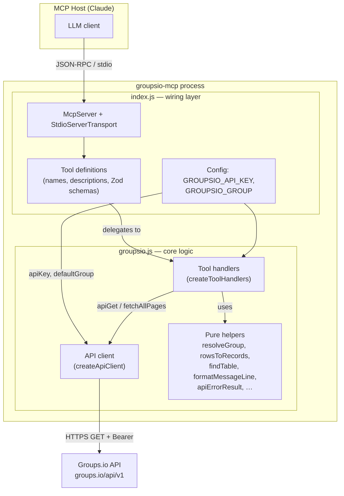
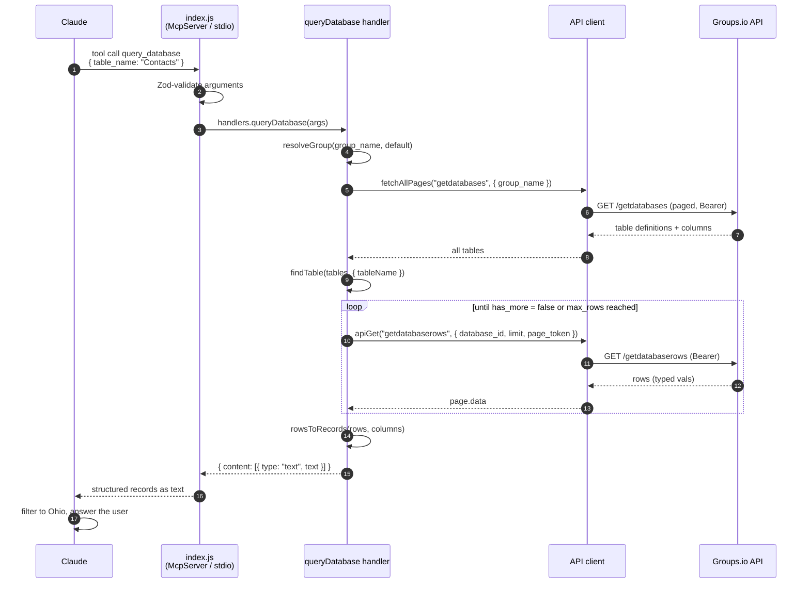

# Architecture Overview

This document describes the architecture of **groupsio-mcp**, a [Model Context
Protocol](https://modelcontextprotocol.io) (MCP) server that lets an LLM client
such as Claude query a [Groups.io](https://groups.io) group conversationally —
its members, subgroups, message archives, and user-defined databases.

It is organized from the outside in: first the **system context** (how the
connector sits between Claude and Groups.io), then the **internal components**
(how the module is wired), and finally the **request lifecycle** of a
representative tool call.

## System context

The connector is a small, stateless process that bridges two parties that
otherwise cannot talk to each other: an MCP-capable LLM host on one side, and
the Groups.io REST API on the other.

Key properties of the boundary:

- **Transport to Claude is stdio.** The host launches the connector as a child
  process (`node index.js`) and speaks MCP/JSON-RPC over stdin/stdout. There is
  no network listener and no port. Configuration is passed via environment
  variables in the host's MCP config.
- **Transport to Groups.io is HTTPS.** Every call is an authenticated `GET`
  against `https://groups.io/api/v1`, using a `Bearer` API key supplied through
  `GROUPSIO_API_KEY`.
- **The connector is stateless and read-only.** It holds no session, cache, or
  database of its own. Each tool call resolves a target group, makes one or more
  API calls, formats the result as text, and returns. All of the exposed tools
  are read operations.
- **Trust boundary.** The API key lives only in the connector's process
  environment; it is never sent to Claude. Claude sees only the formatted text
  results of tool calls.

### Configuration inputs

| Variable | Required | Role |
|---|---|---|
| `GROUPSIO_API_KEY` | ✅ | Bearer credential for every Groups.io request. Missing key aborts startup. |
| `GROUPSIO_GROUP` | optional | Default group name when a tool call omits `group_name`. |

## Internal structure

The codebase is deliberately split into a **thin wiring layer** and a **testable
core**. The MCP SDK is touched in exactly one file; all business logic lives in
plain functions with their external dependencies (HTTP, config) injected.

### Modules

| File | Responsibility |
|---|---|
| `index.js` | Entry point and **wiring only**. Reads config, fails fast if the API key is missing, constructs the API client and handlers, then registers each tool on an `McpServer` with its description and Zod input schema. Connects the server to a `StdioServerTransport` and starts listening. |
| `groupsio.js` | All **business logic**, with no MCP dependency. Three concerns live here: the **API client**, the **tool handlers**, and a set of **pure helpers**. Everything is exported with injectable dependencies so it can be unit-tested without a real network or MCP host. |

### The three concerns in `groupsio.js`

**1. API client (`createApiClient`)** — the only component that touches the
network. It is a closure over `{ apiKey, baseUrl, fetchFn }`, where `fetchFn`
defaults to the global `fetch` but can be replaced with a fake in tests. It
exposes two methods:

- `apiGet(endpoint, params)` — builds the URL, drops `undefined`/`null` params,
  attaches the `Bearer` header, parses JSON, and normalizes both transport
  errors and Groups.io's `{ object: "error" }` envelope into thrown `Error`s.
- `fetchAllPages(endpoint, params)` — wraps `apiGet` in Groups.io's
  cursor-pagination loop (`limit: 100` + `next_page_token`), accumulating
  `page.data` until `has_more` is false. Used wherever a full list is needed
  (members, subgroups, subscriptions, databases).

**2. Tool handlers (`createToolHandlers`)** — a closure over `(client,
defaultGroup)` returning one handler per tool. Each handler follows the same
shape: resolve the group, call the client, then format the response into the MCP
text envelope `{ content: [{ type: "text", text }] }`. Handlers never construct
their own HTTP requests; they go through the injected `client`.

**3. Pure helpers** — small, dependency-free functions shared across handlers:

| Helper | Purpose |
|---|---|
| `resolveGroup` | Apply the `group_name` → `GROUPSIO_GROUP` → error fallback. |
| `textResult` | Wrap a string in the MCP content envelope. |
| `apiErrorResult` / `catchApiError` | Translate Groups.io error types (`not_subscribed`, `no_such_group`, `no_permission`, `unauthorized`, …) into friendly `isError` results instead of crashing the tool call. |
| `clampLimit` | Cap caller limits at the API's 100-per-page maximum. |
| `findTable` | Resolve a database table by id or case-insensitive name. |
| `rowsToRecords` / `extractValue` | Flatten Groups.io's typed `vals` row format into plain `{ ColumnName: value }` records the LLM can reason over directly. |
| `formatMessageLine` | One-line archive-message summary shared by `get_messages`, `get_topic_messages`, and `search_archives`. |
| `deriveRole` | Map `mod_status` to `owner` / `moderator` / `member`. |

### Why this split

The `index.js` / `groupsio.js` boundary exists so the logic can be tested
without standing up an MCP host or hitting the live API. Because `createApiClient`
takes an injectable `fetchFn` and `createToolHandlers` takes an injectable
`client`, the unit tests (`test/groupsio.test.js`) exercise handlers against a
fake client, while `test/integration.test.js` runs the real client against the
live Groups.io API. The MCP SDK is imported in only one file, keeping the
protocol coupling contained.

## Tool surface

The wiring layer registers twelve read-only tools. They fall into four groups by
the part of Groups.io they expose:

| Area | Tools |
|---|---|
| Group & membership | `get_group`, `get_members`, `list_subgroups`, `get_subscriptions` |
| Message archive | `list_topics`, `get_messages`, `get_message`, `get_topic_messages`, `search_archives` |
| Databases | `list_databases`, `describe_database`, `query_database` |

Most tools accept an optional `group_name` that defaults to `GROUPSIO_GROUP`.
The database tools are the connector's distinctive capability: since the
Groups.io API offers no server-side filtering, `query_database` auto-paginates
every row (up to `max_rows`) and hands the LLM structured records to filter and
summarize in context.

## Request lifecycle

The sequence below traces a representative call — *"Who in the contacts database
lives in Ohio?"* — through every layer. It shows the two characteristic patterns
of the connector: **multi-call orchestration** (resolve the table, then page its
rows) and **shaping raw API data into LLM-friendly records**.

### Error handling along the path

Two distinct failure modes are handled differently:

- **API / runtime errors** (group not found, no permission, bad key, network
  failure) are caught by `catchApiError` and returned as an `isError` text
  result with a friendly, actionable message. The tool call *succeeds* at the
  protocol level; Claude sees the explanation and can adjust (e.g. retry with
  the `parentgroup+subgroup` format).
- **Programming / contract errors** (a required `msg_num`, `topic_id`, or
  search query is missing; neither `table_name` nor `table_id` given) are thrown
  before the API is ever contacted, surfacing as genuine tool errors.

## Constraints and notes

- The Groups.io API is marked **ALPHA** and subject to change; field-name
  mismatches have already required fixes (see git history).
- There is **no server-side database filtering**, which is why `query_database`
  pulls all rows and relies on the LLM to filter — a deliberate trade-off
  bounded by `max_rows` (default 500).
- The connector is **read-only by design**. No tool mutates Groups.io state.
- Architecturally significant changes are expected to go through an ADR first;
  see [`decisions/`](decisions/) and
  [ADR 0001](decisions/0001-adopt-architecture-decision-records.md).
